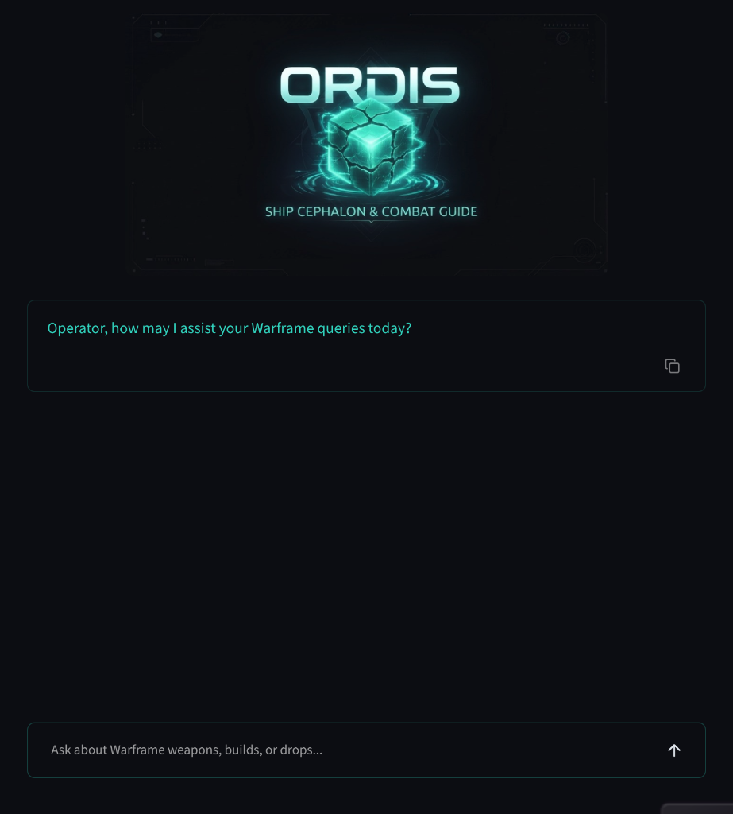

# ORDIS: Warframe Information & Combat Guide



ORDIS is a fully local, containerized microservice Retrieval-Augmented Generation (RAG) system built in Python. Designed as an interactive assistant for the Warframe universe, ORDIS provides an immersive dark HUD chat interface powered by FastAPI, Streamlit, ChromaDB, Model Context Protocol (MCP) servers, and local Ollama (Gemma) model inference.

---

## 🌟 Key Features

- **100% Local & Privacy-Focused**: Zero mandatory remote cloud dependencies or API keys required. Runs completely on local hardware.
- **Grounded RAG Pipeline**: Combines vector similarity search (ChromaDB) with live Warframe Codex datasets.
- **Model Context Protocol (MCP)**: Pluggable MCP cluster fetching real-time items feeds, Fandom Wiki guides, warframe.market trade statistics, and community builds.
- **Sub-Millisecond Semantic Caching**: High-performance in-memory LRU cache storing vector embeddings to serve sub-millisecond hits for identical or similar queries.
- **Enterprise-Grade Security & Rate Limiting**: Protected by OAuth2 JWT Bearer tokens, prompt length limits, security cooldowns, and HTML sanitization hooks.
- **Decoupled Microservice Stack**: Fully containerized via Docker Compose with lightweight non-root images.

---

## 🏗️ Architecture & Component Overview

```
ordis/
├── docker-compose.yml                  # Orchestrates microservices (Ollama, Chroma, MCP, Backend, Frontend)
├── Dockerfile.backend                  # Container build for FastAPI backend (Python 3.11-slim, non-root)
├── Dockerfile.frontend                 # Container build for Streamlit frontend (Python 3.11-slim, non-root)
├── backend/
│   ├── main.py                         # FastAPI REST API & SSE streaming chat endpoints
│   ├── config.py                       # Centralized settings & environment configurations
│   ├── auth.py                         # OAuth2 password flow & Bearer JWT token verification
│   ├── rag_engine.py                   # Local RAG execution pipeline (Ollama Gemma + ChromaDB)
│   ├── vector_store.py                 # Abstract BaseVectorStore & ChromaDB vector indexer
│   ├── cache.py                        # In-memory Semantic LRU Cache (Cosine Similarity >= 0.92)
│   ├── hooks.py                        # Extensible pre-prompt & post-response middleware hooks
│   ├── telemetry.py                    # Configurable telemetry (Local JSONL default, optional GCP)
│   ├── mcp_manager.py                  # Client manager querying connected MCP servers
│   └── background_worker.py            # Asynchronous background worker for initial & 24h data sync
├── mcp_servers/
│   ├── base.py                         # Standardized MCP server protocol contract
│   ├── wfcd_mcp.py                     # MCP Server for Warframe Community items feed
│   ├── wiki_mcp.py                     # MCP Server for Fandom Wiki guide pages
│   ├── market_mcp.py                   # MCP Server for warframe.market trade statistics
│   └── builds_mcp.py                   # MCP Server for Warframe builds & gear setups
├── frontend/
│   ├── app.py                          # Decoupled Streamlit HUD UI calling Backend REST API
│   ├── assets/
│   │   └── ordis_logo.png              # Custom Cephalon core logo asset
│   └── .streamlit/config.toml          # Telemetry opt-out & server configuration
└── tests/                              # Comprehensive Pytest automated test suite
    ├── test_auth.py
    ├── test_main.py
    ├── test_rag_engine.py
    ├── test_vector_store.py
    ├── test_mcp_connectors.py
    ├── test_startup_health.py
    ├── test_telemetry.py
    └── test_background_worker.py
```

---

## 🛡️ Security & Rate Limiting Architecture

ORDIS implements a defense-in-depth security architecture designed for public and enterprise deployments:

1. **OAuth2 JWT Bearer Authentication**:
   - All backend API endpoints (`/api/chat/stream`, `/api/ingest/trigger`) require valid Bearer JWT access tokens issued via `/api/auth/token`.
2. **Chat Rate Limiting & Cooldown Protection**:
   - **Cooldown Safeguard**: Configurable 10-second security cooldown (`COOLDOWN_SECONDS`) between user requests to prevent spam.
   - **Prompt Length Boundary**: Hard limit of 250 characters (`PROMPT_CHARACTER_LIMIT`) to prevent context buffer overflow attacks.
   - **Daily Quota Limit**: Maximum daily query cap (`MAX_DAILY_QUERIES=300`) per user session.
3. **Pre-Prompt Input Sanitization**:
   - Builtin pre-prompt event hook (`default_input_sanitizer_hook`) strips all raw HTML tags and dangerous characters before vector search or LLM invocation.
4. **Hardened Container Security**:
   - Both `backend` and `frontend` Docker images execute as dedicated non-root users (`appuser`).
5. **Telemetry Privacy**:
   - Usage stats and telemetry gathering are completely disabled in Streamlit (`STREAMLIT_BROWSER_GATHER_USAGE_STATS=false`).
   - Inference logs are saved locally to `local_telemetry.jsonl` without transmitting data to external servers.

---

## ⚡ Performance Optimizations

1. **Semantic LRU Caching**:
   - Evaluates incoming query embeddings against cached prompt vectors using cosine similarity.
   - Queries with cosine similarity $\ge 0.92$ return instantly from memory with sub-millisecond response latency, bypassing vector DB and LLM generation.
2. **MD5 Content Hash Deduplication**:
   - Data ingestion computes MD5 hashes for all scraped document chunks. Unchanged chunks are skipped automatically, preventing redundant embedding generation.
3. **Asynchronous Parallel Data Collection**:
   - MCP Manager fetches data concurrently across all registered MCP servers using Python `asyncio.gather()`.
4. **SSE Streaming Completions**:
   - Real-time token streaming (`StreamingResponse`) delivers immediate output feedback to the user HUD interface.

---

## ⚙️ Environment Configuration

Configuration settings are managed in `backend/config.py` and can be overridden via environment variables:

| Variable | Default Value | Description |
| :--- | :--- | :--- |
| `OLLAMA_HOST` | `http://localhost:11434` | Ollama server URL |
| `OLLAMA_MODEL` | `gemma2:2b` | Local LLM model identifier |
| `EMBEDDING_MODEL` | `nomic-embed-text` | Local text embedding model |
| `LLM_TEMPERATURE` | `0.3` | Model generation sampling temperature |
| `LLM_REPEAT_PENALTY` | `1.18` | Token repetition penalty |
| `CHROMA_HOST` | `http://localhost:8000` | ChromaDB vector store host |
| `VECTOR_STORE_PROVIDER` | `chroma` | Vector database provider (`chroma`, `qdrant`) |
| `ENABLE_GCP_TELEMETRY` | `false` | Optional GCP Vertex AI logging flag |
| `OAUTH_SECRET_KEY` | `ordis_cephalon_secret_key` | Secret key for JWT signing |

---

## 🚀 Quickstart via Docker Compose

Launch the full stack with a single command:

```bash
# Build and start containers in detached mode
docker-compose up --build -d
```

### Pull Ollama Models (First Run)
```bash
docker exec ordis-ollama ollama pull gemma2:2b
docker exec ordis-ollama ollama pull nomic-embed-text
```

### Access Services
- **Streamlit HUD UI**: [http://localhost:8080](http://localhost:8080)
- **FastAPI REST API**: [http://localhost:8000](http://localhost:8000)
- **API Documentation**: [http://localhost:8000/docs](http://localhost:8000/docs)
- **MCP Servers Cluster**: [http://localhost:8001/mcp/health](http://localhost:8001/mcp/health)

---

## 🧪 Running Automated Tests

Execute the comprehensive test suite across all microservice layers:

```bash
PYTHONPATH=. .venv/bin/pytest tests/ -v
```

---

## ⚖️ Disclaimer

ORDIS is a community-developed fansite tool for Warframe. Warframe and all related assets, names, and lore are intellectual property of Digital Extremes Ltd.
