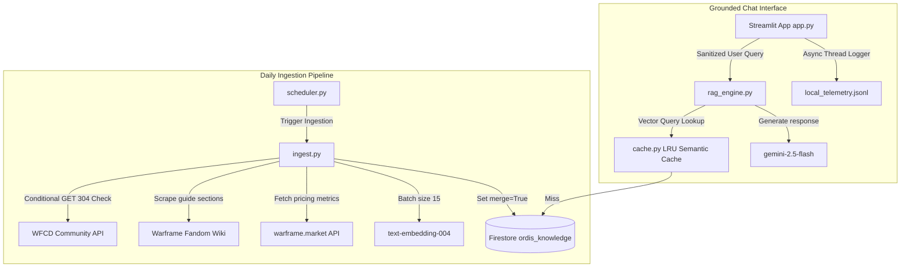

<p align="center">
  
</p>

# ORDIS: Warframe Information & Combat Guide

ORDIS is a zero-cost, highly optimized, and modular Retrieval-Augmented Generation (RAG) system built in Python. Designed as an interactive helper for the Warframe universe, ORDIS utilizes Streamlit for a dark HUD chat dashboard, Google Firestore for native Vector Search, and Gemini 2.5 Flash for grounded responses delivered in the iconic tone of Cephalon Ordis.

---

## 🏗️ Codebase Architecture & Components

The application is structured modularly to separate scraping, caching, vector indexing, inference, and coordination:

1. **[app.py](app.py)**
   - Implements a responsive, dark-themed Streamlit user interface styled to emulate a Cephalon HUD.
   - Enforces user-level safeguards (cooldown timers, prompt character limits, and daily query lockdowns).
   - Dynamically loads and renders the wide Cephalon core branding banner [ordis_logo.png](ordis_logo.png).

2. **[rag_engine.py](rag_engine.py)**
   - Manages the inference pipeline using the Google GenAI SDK.
   - Cleanses queries, rephrases inputs with spelling corrections using typo condensation (`thinking_budget=0` to skip thinking tokens and preserve limits), fetches semantic embeddings, and builds grounding context.
   - Uses the Vertex AI SDK to track prompt metrics, grounding document overlaps, and latency under Vertex AI Experiments.
   - Asynchronously logs query transactions to the local JSONL telemetry file.

3. **[firestore_db.py](firestore_db.py)**
   - Interfaces with Cloud Firestore using the default database instance.
   - Implements native vector search queries using `find_nearest` and `DistanceMeasure.COSINE`.
   - Protects resource consumption by running multi-instance-safe transactions to enforce daily query counts.

4. **[cache.py](cache.py)**
   - Establishes a thread-safe, in-memory **Semantic Cache** using NumPy array math.
   - Bypasses Gemini API inference entirely for repeated or highly similar queries ($\ge 92\%$ cosine similarity), returning answers in milliseconds with $0 API cost.
   - Implements a Least Recently Used (LRU) cache eviction policy capped at 1,000 entries.

5. **[ingest.py](ingest.py)**
   - Automatically crawls and parses game entities from the Warframe community datasets (WFCD), Warframe Fandom Wiki, and `warframe.market` price statistics.
   - Optimizes network calls with conditional HTTP `If-None-Match`/`If-Modified-Since` checks to receive `304 Not Modified` and skip downloading unchanged feeds.
   - Performs batch embedding requests (15 documents per request) via Vertex AI to prevent `429 ResourceExhausted` rate limits.
   - Syncs trade market prices as metadata fields to allow rapid price updates without paying for embedding recalculations.

6. **[scheduler.py](scheduler.py)**
   - A lightweight cron-like background daemon that triggers the full data ingestion and price sync loop every 24 hours.
   - Logs execution metrics and status directly to [scheduler_status.json](scheduler_status.json).

7. **[watch_server.py](watch_server.py)**
   - Coordinates multi-process execution. It monitors codebase directories and reboots both the Streamlit web server and the Scheduler background daemon upon file modifications.

8. **[config.py](config.py)**
   - Houses global configurations, model definitions (`text-embedding-004` and `gemini-2.5-flash`), threshold constants, and pipeline token bounds.

9. **[Dockerfile](Dockerfile)**
   - A production-grade container configuration that runs Python 3.11-slim, exposes port 8080, and executes under a secure, non-root `appuser` for deployment on Cloud Run.

10. **[.dockerignore](.dockerignore)**
    - Excludes virtual environments (`.venv`), Python byte caches, and temporary log/status files from the Docker context to optimize image build times and sizes.

---

## 📈 System Flow & Architecture



---

## 🛡️ Cost-Control & Safeguard Safeguards

ORDIS is built to run safely in public or staging environments without risk of runaway billing:

- **Daily Query Limit**: Capped at 300 queries per day (`MAX_DAILY_QUERIES = 300`). The counter is transactionally managed in Firestore and automatically resets at UTC midnight. When the quota is reached, the Streamlit input is visually locked and disabled.
- **Cache-Miss Exemption**: Semantic cache hits bypass the daily usage counter increment. Users can query cached prompts indefinitely at no API cost.
- **Ingestion Budget Guards**: Limits embedding token ingestion to `300,000` tokens per sync cycle, limits market crawls to `200` calls, and wiki fetches to `50` calls, blocking excessive API billing.
- **User Cooldown**: Implements a session rate limit requiring 10 seconds of cooldown between consecutive inputs.
- **Input Character Limit**: Filters and truncates queries exceeding 250 characters directly in the UI.

---

## 🔍 Validation & Live Pricing Grounding

1. **Trade Grounding**: When querying items (e.g., *"How much is Nikana Prime worth?"*), the vector search pulls the document, extracts the dynamically synced `market_price` metadata field (`Median Price: 70.0 platinum...`), and injects it into the LLM context.
2. **Cephalon Personality**: The system instructions are designed to adopt Cephalon Ordis's personality—polite, stable, and helper-oriented, addressing the user as "Operator" while explaining complex underlying game mechanics (damage types, status multipliers).
3. **No-Thinking Budget for condensor**: Query condensation is configured with `thinking_budget=0` to ensure prompt rephrasing operates instantly without consuming unnecessary thinking tokens.

---

## 🚀 Running ORDIS Locally

### 1. Environment Setup

Configure application credentials or developer API keys:
```bash
export GOOGLE_CLOUD_PROJECT="warframe-503817"
export GEMINI_API_KEY="your-gemini-api-key-here"  # Or rely on Application Default Credentials (ADC)
```

Create a virtual environment and install packages:
```bash
python3 -m venv .venv
source .venv/bin/activate
pip install -r requirements.txt
```

### 2. Start the watch daemon (Recommended)

To run the full suite (Streamlit application + background ingestion scheduler) with automatic hot-reloading:
```bash
python watch_server.py
```
Open your browser and navigate to `http://localhost:8080` to interact with ORDIS.

### 3. Run Ingestion Manually

To bypass the scheduler and trigger a direct sync:
```bash
python ingest.py
```
This parses feeds, fetches embeddings, and updates trade pricing stats immediately.

### 4. Run via Docker (Containerized)

To build the image and run ORDIS in a secure container mounting local Google Cloud Application Default Credentials (ADC):

#### A. Standard Linux / macOS Setup
```bash
# 1. Ensure your local credentials file is readable
chmod 644 ~/.config/gcloud/application_default_credentials.json

# 2. Build the Docker image
docker build -t ordis-app .

# 3. Run the container
docker run -p 8080:8080 -d \
  --name ordis-container \
  -v ~/.config/gcloud:/root/.config/gcloud:ro \
  -e GOOGLE_APPLICATION_CREDENTIALS=/root/.config/gcloud/application_default_credentials.json \
  -e GOOGLE_CLOUD_PROJECT="warframe-503817" \
  ordis-app
```

#### B. WSL2 & Windows Docker Desktop Setup
If you are running inside WSL2 and using the Windows host Docker Desktop daemon (`docker.exe`), you cannot mount paths directly from the WSL2 Linux filesystem. Follow this workaround:

```bash
# 1. Create a directory on the Windows C: drive and copy the credentials file there
mkdir -p /mnt/c/temp_ordis_credentials
cp ~/.config/gcloud/application_default_credentials.json /mnt/c/temp_ordis_credentials/gcloud_cred.json

# 2. Build the Docker image
"/mnt/c/Program Files/Docker/Docker/resources/bin/docker.exe" build -t ordis-app .

# 3. Run the container, using the native Windows path for host mounting
"/mnt/c/Program Files/Docker/Docker/resources/bin/docker.exe" run --user root -p 8080:8080 -d \
  --name ordis-container \
  -v 'C:\temp_ordis_credentials\gcloud_cred.json:/app/gcloud_cred.json:ro' \
  -e GOOGLE_APPLICATION_CREDENTIALS=/app/gcloud_cred.json \
  -e GOOGLE_CLOUD_PROJECT="warframe-503817" \
  ordis-app
```
